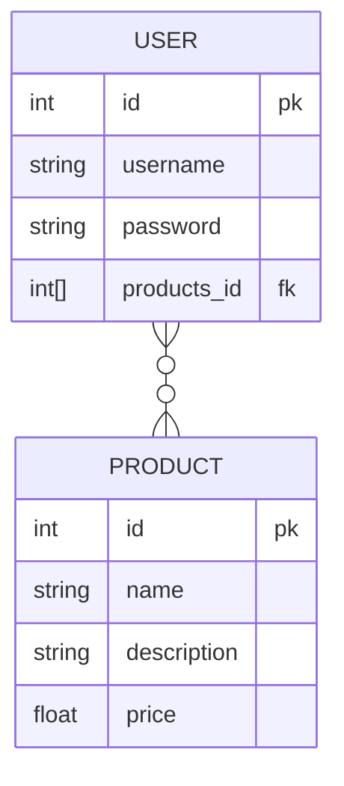

## Schema

```mermaid

erDiagram
    USER {
        int id pk
        string username
        string password
        int[] products_id fk
    }

    PRODUCT {
        int id pk
        string name
        string description
        float price
    }

    USER }o--o{ PRODUCT : ""

```